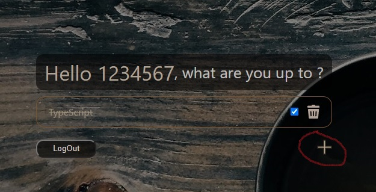

## Project name:
### Todo List application

## Description:

This application helps users to create tasks, complete or/and delete them.

## Technologies:

- TypeScript
- React
- Styled-components
- Redux
- Redux-saga
- BrowserRouter
- Typesafe-actions
- Jest
- Eslint
- Prettier

## Project setup
  
npm install

  
npm start

# Demo:

### Enter your username and password to use the application

 

### Or go through registration

Name must be at least 2 characters long

Email must be at least 7 characters long

Password must be at least 7 characters long

### To add there click on the cross(marked in red)

 

### Enter a title, description and click the button Add Todo

 

### To see the description of todo click on the name of todo(marked in red)

 

### To complete todo click on the checkbox(marked in red)

 

### To remove todo click on the trash can icon(marked in red)

### To exit the application press the button LogOut(marked in red)

